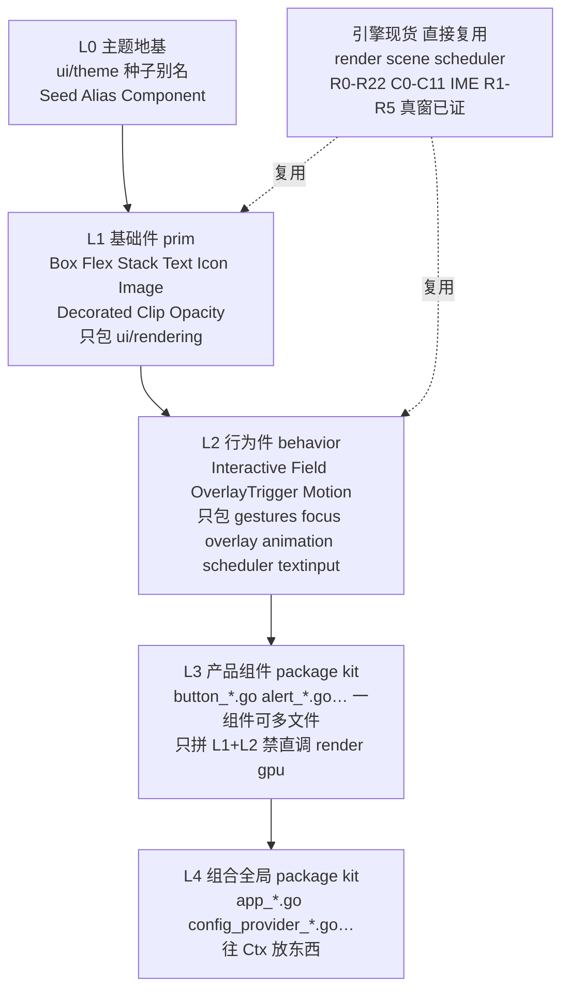
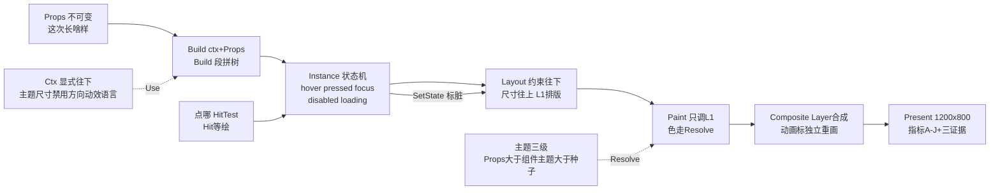

# 组件实现架构图（Flutter 对齐版）

> 与 `ARCHITECTURE.md` + `WIDGET_MODEL.md` 同源。下文两张图：层图（谁包谁）+ 流程图（一次点击从哪进从哪出）。

## 层图（只许往下调）



## 流程图（一次点击）



## 文字版（聊天里看）

```text
L0 主题地基（种子别名组件三级，悬停按压派生对数）
  | 只许往下用
L1 基础件 prim（Box/横排竖排/叠放/文字图标图片/底边圆角/裁剪透明变换）
  | 包住 ui/rendering，不写 GPU
L2 行为件 behavior（五态机/表单值校验/浮层定位外点关焦点锁/动效节拍）
  | 包住 gestures/focus/overlay/animation/scheduler/textinput
L3 产品组件（package kit，一组件可多文件，文件内分 Props/State/Render/Theme/Build 五段，只拼 L1+L2）
  | 禁直调 render/gpu，禁自写定位手势焦点
L4 组合全局（表单表格弹窗联调，App/配置往 Ctx 放东西）

一次渲染：Props + Ctx -> 拼树 -> 状态机 -> 布局 -> 绘制 -> 合成 -> 呈现
一次点击：命中（点哪高亮哪）-> 状态机 -> 标脏 -> 重排重画 -> 呈现
主题取值：这次写的 > 组件主题 > 全局种子，按状态解析，不写散装判断
```
